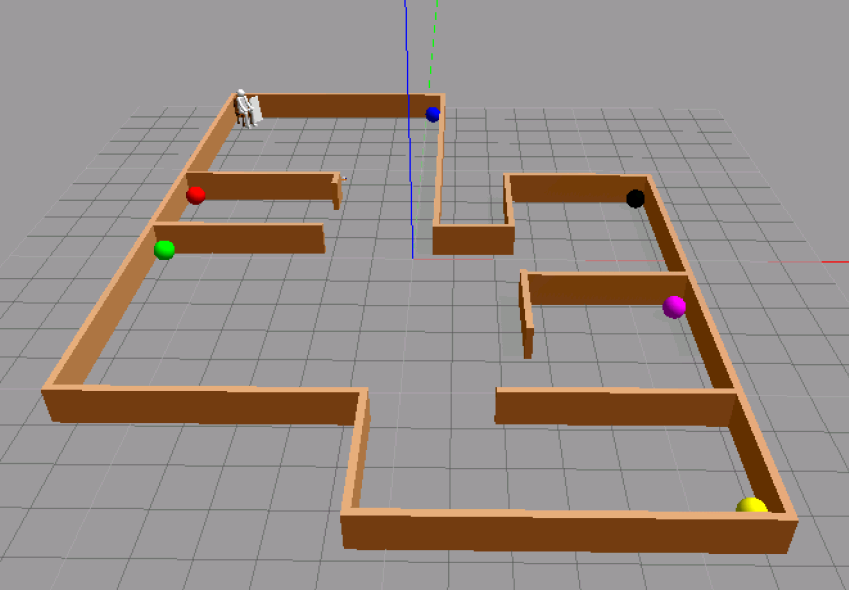

# Final Assignment exp_assignment3

### Introduction 

The project use a wheeled robot to move in the environment to detect balls corresponding different room, after passing in a Play state we can send a command to the robot to find the desired room. In this assignment we used a existing urfd file of a basic robot used on exercise on class, it use an RGB camera and a Laser in order to detect the objects and navigate in the environment.

_Figure 1 : Gazebo enviroment_

In advance is known the correspondence between a location and the color. 
- Blue: Entrance;
- Red: Closet;
- Green: Living room;
- Yellow: Kitchen;
- Orange: Bathroom;
- Black: Bedroom;

### FSM behaviours

We used a State Machine for the behaviours of the robot: 
* Normal State, this state is used to navigate randomly in the map, if the camera detect an object it switch to the **Track State**, if nothing is detected for a while is pass in **Normal State** or **Sleep State**; 
* **Sleep State**, this is the easiest state because the robot just return on the Home position ( 0,0,0 ) and waits some time to switch on **Normal State**;
* **Play State**,this state is reached whenever it receives a _Play_ command by the user (he can't receive a _Play_ command in the **Track State**!) . When in this state, the robot goes to the user position (in front of the user)  and waits for a _GoTo_ command. When a _GoTo_ command is received, if the location is known, the robot reaches that location and then comes back to the user, waiting for another command. If the locations is unknown, the robot switches to **Find State**.
* **Find State**, this states the robot moves in the environment, exploring it, and looking for new objects. when it detects a new one, switches in the **sub-state Track** and if the object corresponds to the desired location returns in the **Play State**, otherwise it keeps looking. If after some time the location is not found, it returns anyway to the **Play State** where it will wait for a new command.

### Software Architecture

The main script is the _fsm.py_ , it contains the State Machine which communicate with the _CVDetection.py_ only in two defined state , the **Normal State** and **Find State**; in the **Play** and **Sleep State** the algorithm for the track is in stand-by , this is possible using a publisher/subscriber communication to the topic _/fsm _with a message of type _Bool()_, is true in the **Normal Find State** and false in the **Play** and **Sleep** case.

)
