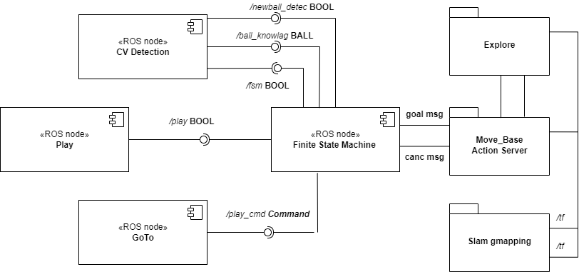

# Final Assignment exp_assignment3

### Introduction 

The project use a wheeled robot to move in the environment to detect balls corresponding different room, after passing in a Play state we can send a command to the robot to find the desired room. In this assignment we used a existing urfd file of a basic robot used on exercise on class, it use an RGB camera and a Laser in order to detect the objects and navigate in the environment.


_Figure 1 : Gazebo enviroment_

In advance is known the correspondence between a location and the color. 
- Blue: Entrance;
- Red: Closet;
- Green: Living room;
- Yellow: Kitchen;
- Orange: Bathroom;
- Black: Bedroom;

### FSM behaviours

We used a State Machine for the behaviours of the robot: 
* Normal State, this state is used to navigate randomly in the map, if the camera detect an object it switch to the **Track State**, if nothing is detected for a while is pass in **Normal State** or **Sleep State**; 
* **Sleep State**, this is the easiest state because the robot just return on the Home position ( 0,0,0 ) and waits some time to switch on **Normal State**;
* **Play State**,this state is reached whenever it receives a _Play_ command by the user (he can't receive a _Play_ command in the **Track State**!) . When in this state, the robot goes to the user position (in front of the user)  and waits for a _GoTo_ command. When a _GoTo_ command is received, if the location is known, the robot reaches that location and then comes back to the user, waiting for another command. If the locations is unknown, the robot switches to **Find State**.
* **Find State**, this states the robot moves in the environment, exploring it, and looking for new objects. when it detects a new one, switches in the **sub-state Track** and if the object corresponds to the desired location returns in the **Play State**, otherwise it keeps looking. If after some time the location is not found, it returns anyway to the **Play State** where it will wait for a new command.

### Software Architecture

The main script is the _fsm.py_ , it contains the State Machine which communicate with the _CVDetection.py_ only in two defined state , the **Normal State** and **Find State**; in the **Play** and **Sleep State** the algorithm for the track is in stand-by , this is possible using a publisher/subscriber communication to the topic _/fsm _with a message of type _Bool()_, is true in the **Normal Find State** and false in the **Play** and **Sleep** case.

)

The State Machine send a Goal to the Move Base Action Server with the topic _/move base_ in order to reach the position , can be the Home position or a random one for the Normal behavior. If the robot is in the Find behavior the Explore node is launched and it's work with the _\explore lite_ package which allows the robot to navigate in an unknown environment relying again on the Move Base Action server.

Publishing to the topic _/move base/cancel_ we can interrupt the Move Base Action server in the Play State case, to continuously navigate in the map avoiding walls we use the Slam Gmapping package which considering the information obtained by the laser _/topic /scan_, sends the transformations frames _/tf_ to both Move Base and Explore blocks. 

The CVDetection node, instead, communicates to the State Machine whenever a new ball (a not already detected one) is found in the environment while moving in Normal or in Find behaviour. This is done with a publisher/subscriber communication to the topic _/newball_detec_ and the message sent is of type _Bool()_ that is true when a ball is detected.
This node also communicates to the State Machine the information about the new detected object, which are about the ball's position and about its color. This is done again with a publisher/subscriber communication to the topic _/ball_knowlag_ and message is of type _ball()_.

_ball.msg_

```
float32 x   % X position of the ball
float32 y   % Y position of the ball
string color    % color of the ball
```

If we want to switch to the **Play State** we need to launch the Play.py scrips which communicate to the State Machine to go on Play state; If we want to comunicate a GoTo + location command with the following msg:

```
string go   % contains the GoTo command
string location % desired location
```

### Installation and running procedure

To run the simulation it's necessary to put the package in a ROS workspace and then in the terminal run:
```
$ catkin_make
```
Then to launch the simulation:
```
$ roslaunch exp_assignment3 simulation.launch
```
this command lauches the Gazebo simulation, RViz, the CVDetection node, Gmapping + MoveBase for the navigation with obstacle avoidance, and the State Machine node.
In order to kill all the processes before launching the file and avoide problems with Gazebo. 
Whenever the user want to make the robot go in the **Play state**:
```
$ rosrun exp_assignment3 play.py
```
And to send a GoTo + location command :
```
$ rosrun exp_assignment3 GoTo.py
```
After launching this file, it will be asked to the user to insert a location that will be the one that the robot will have to reach or find.

Geraldo Margjini , geraldomargjini@gmail.com
